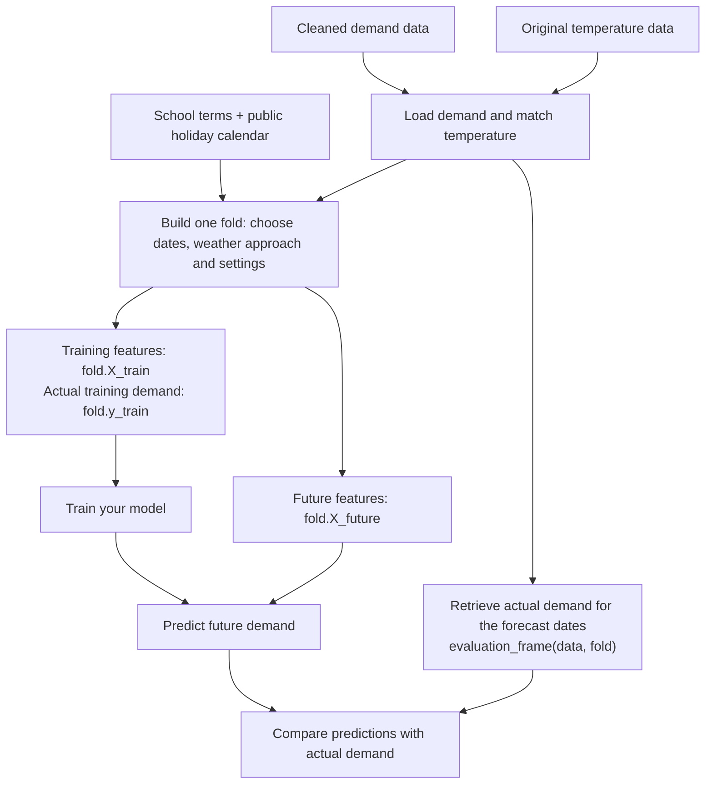

# Task 11: using the shared feature tables

I added the feature preparation for Task 11 so we can use the same starting data and forecast periods in our model notebooks. It uses Daniel's cleaned NSW demand data, adds calendar and temperature features, and prepares training and prediction tables.

The tables are generated for the fold and weather approach you choose. There isn't one fixed feature CSV to download, and you don't need to run the demonstration notebook first.

Our research question is: **Which forecasting models perform best for medium to long term electricity demand in New South Wales when evaluated across seasonal variation, temperature changes, and differing demand levels?**

## Data flow at a glance



Task 11 prepares the tables. Your model learns from `X_train` and the matching
recorded demand in `y_train`, then predicts using `X_future`. Future features
are prepared alongside the training tables; they contain no actual future
demand. Actual demand for the forecast dates is retrieved separately for comparison.

## Where to start

| File | What it's for |
|---|---|
| [forecast_data.py](forecast_data.py) | Shared functions to import into your model notebook. |
| [feature_engineering.ipynb](feature_engineering.ipynb) | A walkthrough with example inputs and outputs. |
| [Calendar folder](../data/NSW/calendar/README.md) | School dates, public-holiday sources and a readable copy of the fold schedule. |
| [requirements-task11.txt](../requirements-task11.txt) | Packages needed for feature preparation. Model packages are separate. |
| [tests/](../tests/) | Checks for the preparation code and the real dataset. |

You can start with the example below and refer to the function guide when needed. Reading the whole Python library isn't necessary to use it.

## Set up your environment

Create and activate a virtual environment with Python 3.10 or later using your preferred tool, such as uv, venv or Conda. The commands below assume pip is available in that environment; with uv, you can use `uv pip install -r requirements-task11.txt` for the installation step.

From the main project folder (`ZZSC9020-group-A`), run:

```shell
python -m pip install -r requirements-task11.txt
python -B -m unittest discover -s tests -v
python -B tests/validate_task11.py
```

The first test command checks individual rules, such as temperature averages, leap days and holiday dates. The second prepares all ten folds in **all three weather modes** and checks the resulting tables. It saves a record in [task11_validation.json](../results/task11_validation.json). Neither command trains a model or calculates forecast accuracy. `-B` just avoids creating Python cache files.

Select this same environment as your notebook's kernel. If the editor cannot find it, install `ipykernel` in the environment with `python -m pip install ipykernel`, then select it again. Install your model's packages separately, such as LightGBM or XGBoost.

## Get the feature tables in your model notebook

This example works from the project folder, `src`, or `src/models`. It prepares the first development exercise: learn from 2010-2015 and predict 2016.

```python
from pathlib import Path
import sys

# Locate the project so imports work from a model notebook too.
ROOT = next(p for p in [Path.cwd(), *Path.cwd().parents]
            if (p / 'src' / 'forecast_data.py').exists())
if str(ROOT) not in sys.path:
    sys.path.insert(0, str(ROOT))

from src.forecast_data import (
    FeatureConfig, load_prepared_data, load_school_terms, default_splits,
    build_fold, predictions_frame, evaluation_frame, export_fold,
)

CONFIG = FeatureConfig(climatology_window_days=3)

# Load the source data and calendar.
data = load_prepared_data(ROOT, CONFIG)
terms = load_school_terms(ROOT)
splits = default_splits()

# Select one exercise and prepare its inputs.
split = splits.query("role == 'development'").iloc[0]
fold = build_fold(data, split, terms, weather_mode='analogue', config=CONFIG)

print('Training inputs:', fold.X_train.shape)
print('Training demand:', fold.y_train.shape)
print('Future inputs:', fold.X_future.shape)
display(fold.X_train.head())
display(fold.X_future.head())
```

`fold` is a container called `ForecastFold`. These are the three tables you need to start:

| Table | Contents | Use |
|---|---|---|
| `fold.X_train` | Historical feature rows | Inputs for training your model. |
| `fold.y_train` | Actual demand matching those rows, in MW | Answers your model learns to predict. |
| `fold.X_future` | Features for the prediction period | Inputs for making predictions. |

`X` means inputs and `y` means demand. MW means megawatts, a unit of power. Each row represents one half-hour demand timestamp. `DATETIME` remains the row index so predictions can be matched to the correct observations.

The fold also has `metadata`, `train_quality` and `future_metadata` for inspecting its preparation. They are supporting information, not additional model features.

## What the functions do

| Function or class | What it does |
|---|---|
| `FeatureConfig(...)` | Holds settings such as weather matching, averaging-window width and harmonic counts. |
| `load_prepared_data(ROOT, CONFIG)` | Reads demand from Daniel's `nsw_cleaned.csv`, recovers recording times from the original temperature ZIP, and marks unreliable temperature matches as missing. Returns the source table; filling happens when a fold is built. |
| `load_school_terms(ROOT)` | Reads the school-term CSV for the holiday feature. |
| `default_splits()` | Returns the schedule of eight development folds and two final tests. |
| `calendar_features(times, terms, CONFIG)` | Creates calendar inputs for a set of timestamps. Called inside `build_fold()`. |
| `public_holiday_calendar(years)` | Generates the NSW holiday dates used by `calendar_features()`, including documented historical corrections. |
| `build_fold(...)` | Selects training and future rows, fills temperature gaps using training history, and creates the feature tables. It does not train a model. |
| `predictions_frame(fold, predictions, model_name)` | Puts your predictions into a table with timestamps, model name, fold and weather mode. It does not save a file. |
| `evaluation_frame(data, fold)` | Retrieves actual demand for comparison and adds season, temperature and demand groups for reporting. |
| `export_fold(fold, output_dir)` | Optionally saves the selected fold's tables to files. |

The five arguments to `build_fold()` are `data` (source table), `split` (one schedule row), `terms` (school calendar), `weather_mode` (future temperature approach), and `config` (preparation settings).

## Choose a fold and weather approach

A **fold** is one forecasting exercise. Its **origin** is the first timestamp to predict. Training ends just before it; `forecast_end_exclusive` is the first timestamp outside the prediction period.

| Folds | Prediction starts | Training starts | Prediction length |
|---|---|---|---|
| Development: 8 | January, April, July and October in 2016 and 2017 | January 2010 | 12 months each |
| Final tests: 2 | January 2019 and January 2020 | January 2010 | 12 months each |

The three-month spacing tests forecasts starting in different seasons. It does not shorten the forecast to three months. The windows overlap, so the fold ID distinguishes predictions for the same date made from different starting points. These dates are the current implementation choices, not fixed dates from the assessment brief.

To select the second development fold, change `.iloc[0]` to `.iloc[1]`. To select a specific fold:

```python
split = splits.query("fold_id == 'development_20160701'").iloc[0]
fold = build_fold(data, split, terms, weather_mode='analogue', config=CONFIG)
```

Development folds are for trying features and model settings. The final tests assess the chosen approach after those choices are fixed. For the 2020 test, the same approach is retrained with history that includes 2019; the 2019 final scores aren't a new tuning round. Report the two final years separately because 2020 was unusual. Both final forecasts start in January.

| `weather_mode` | Temperatures used for future inputs |
|---|---|
| `'analogue'` (default) | The calendar year before the origin's year, matching month, day and half-hour. A January 2016 origin borrows 2015 temperatures. |
| `'climatology'` | A historical average for each date and half-hour, using the window described below. |
| `'observed_diagnostic'` | Actual future recorded temperatures, to examine performance when weather is known. This is a separate diagnostic, not a realistic year-ahead forecast. |

All three have identical training inputs for the same fold and CONFIG. To switch to average weather, use `weather_mode='climatology'` when building the fold.

## Features included

The default tables contain 28 numeric columns. Flags appear as `0.0` and `1.0`, with the same meaning as no and yes.

| Columns | Meaning |
|---|---|
| `half_hour`, `hour` | Sydney local half-hour position (0-47) and hour (0-23). |
| `day_of_week`, `month`, `day_of_year` | Monday=0 through Sunday=6; month 1-12; day 1-365/366. |
| `is_weekend`, `is_public_holiday`, `is_school_holiday` | Separate flags. A Saturday public holiday can have both relevant flags set. |
| `utc_offset_hours` | Sydney's offset from UTC: 10 in standard time or 11 in daylight saving. |
| `trend_years` | Years elapsed since January 2010. |
| `daily_sin_1..3`, `daily_cos_1..3` | Six columns describing repeating daily patterns. |
| `weekly_sin_1..2`, `weekly_cos_1..2` | Four columns describing repeating weekly patterns. |
| `annual_sin_1..3`, `annual_cos_1..3` | Six columns describing repeating yearly patterns. |
| `cooling_degrees_18c`, `heating_degrees_18c` | Degrees above or below 18 C: `max(T - 18, 0)` and `max(18 - T, 0)`. |

The sine/cosine columns are **harmonics**: repeating waves calculated from timestamps. They help models learn recurring patterns without using future demand. The temperature columns are differences in degrees C for each row, not daily accumulated degree-days. At 25 C they are 7 and 0. Raw temperature is available in the supporting tables; the feature tables use these two derived columns.

There are no demand-lag or operator-forecast columns in the shared feature tables. The operator forecasts in Daniel's file cover short horizons, rather than the year-ahead exercise here. Any model-specific encoding, scaling or feature selection belongs in the model notebook and is fitted using training data.

## Where the data comes from

**Demand and temperature.** Demand comes from `data/NSW/nsw_cleaned.csv`. Daniel matched each demand row to its nearest temperature reading. The original temperature ZIP is read again because the cleaned CSV doesn't retain the temperature's own recording time. This lets the code reject matches more than 30 minutes away; 341 rows in the full dataset have this issue. Original files are not changed.

Missing or unavailable training temperatures are filled using valid training readings at the same source-clock half-hour in a centred three-day window. For 15 February at 10:00, that means 14, 15 and 16 February at 10:00 across training years. Every valid reading has equal weight. An empty window falls back to the overall valid training mean. The same calculation fills donor gaps and supplies every future temperature in climatology mode.

Windows cross month and year boundaries. For 29 February, the window centres on 28 February in non-leap training years. Analogue mode instead copies the 28 February donor reading when its donor year has no 29 February. Actual future temperatures are only used in the observed diagnostic. Bankstown weather is a single-station approximation for NSW conditions.

**Timezones.** The current settings assume both source files use fixed AEST; the files themselves don't declare a timezone. Source timestamps remain the row labels. Calendar features use Sydney local time, so a source timestamp of midnight in January gives a local `hour` of 1.

**School holidays.** [school_terms.csv](../data/NSW/calendar/school_terms.csv) contains the four term date ranges for each year from 2010 to 2021, for NSW government schools in the Eastern Division, including Sydney. A date inside a term gets `is_school_holiday=0`; a date outside all terms gets `1`. Both the start and end dates count as inside the term.

The dates are administrative term boundaries, including staff development days, rather than just student attendance dates. Staff development days are days when teachers work or receive training while students may stay home. For example, if a published term starts Monday and students return Tuesday, the CSV uses Monday as the start. Both days get `is_school_holiday=0`. There is no separate staff-day list or override: a date outside the recorded boundaries would get `1`, even if a school used it for staff development.

Weekends and public holidays do not change the school-holiday flag. Each flag answers a separate question:

| Example | `is_school_holiday` | `is_weekend` | `is_public_holiday` |
|---|---:|---:|---:|
| Ordinary Saturday inside a term | 0 | 1 | 0 |
| Ordinary Saturday during school vacation | 1 | 1 | 0 |
| Weekday public holiday inside a term | 0 | 0 | 1 |
| Weekday public holiday during school vacation | 1 | 0 | 1 |

The original 2010-2015 school-publication links stopped working. Replacement references now support the same dates: the University of Sydney's 2010 student guide, Parramatta Council's 2011-2012 table, and a Transport for NSW guide for 2014-2015. The 2016-2021 dates still use the NSW Department of Education's historical calendar. No term dates changed when the references were updated.

For 2013, a third-party reproduction of an Education Gazette table matches the CSV, but a dependable original-source link is still needed. This is the remaining gap in the references.

Each CSV row has a `source_id`. Find it in the source table near the top of the [calendar README](../data/NSW/calendar/README.md) for the current link and PDF page number where applicable. The IDs retain the original source names, so they may differ from the replacement publisher. The code also checks four terms per year, date boundaries and overlaps; those checks do not independently verify the published dates.

This is a sourced calendar of scheduled terms, not a record of daily attendance across all NSW schools. Private-school dates, Western Division differences and unexpected closures are not represented. That is the limitation to mention when describing its reliability.

**Public holidays.** `public_holiday_calendar()` uses the `holidays` package for NSW, with historical corrections documented in the [calendar README](../data/NSW/calendar/README.md). `public_holidays.csv` is a saved reference copy; the function generates the dates at runtime. Similarly, `split_manifest.csv` is a reference copy of the schedule generated by `default_splits()`.

The function requests observed holidays, including substitute dates. It then removes the bank-only holiday and corrects specific 2010/2011 substitute or additional holidays. The calendar README lists each correction and its source. `calendar_features()` checks whether each Sydney local date is in that list and sets `is_public_holiday` to 1 or 0.

## Settings you can experiment with

| Setting | Default | Example experiment |
|---|---|---|
| `climatology_window_days` | 3 | Try 5 days instead: 13-17 February for a 15 February target. Allowed widths are odd integers from 1 to 365. |
| `temperature_tolerance_minutes` | 30 | Compare a different maximum matching gap. |
| `base_temperature_c` | 18 | Try another heating/cooling reference. Non-default values use column names `cooling_degrees` and `heating_degrees`. |
| `daily_harmonics`, `weekly_harmonics`, `annual_harmonics` | 3, 2, 3 | Compare fewer or more repeating waves. |

For example, change the setup to `CONFIG = FeatureConfig(climatology_window_days=5)`, then reload `data` with that CONFIG and rebuild the folds. Restart the kernel after changes to the shared Python module so imports use the updated code.

Using the same development folds makes comparisons easier. When sharing results from an experiment, include the changed settings so a feature change isn't mistaken for a difference between models. The current preparation version is `task11-v2`; it uses date-window averages rather than the earlier monthly averages.

## Use the tables with your model

After creating your own model, a typical tree-model workflow looks like this. Here, `model` is the model you created in your own notebook:

```python
# Learn from historical inputs and demand.
model.fit(fold.X_train, fold.y_train)

# Generate guesses for the prediction period.
predictions = model.predict(fold.X_future)

# Retrieve the actual demand for those same dates.
truth = evaluation_frame(data, fold)

# Put the answers and guesses next to each other.
comparison = truth[['y_true']].copy()
comparison['y_pred'] = predictions
comparison['error'] = comparison['y_pred'] - comparison['y_true']
display(comparison.head())
```

`predictions` holds the model's guesses. They are not automatically added to `fold`. `evaluation_frame(data, fold)` only retrieves the answers and reporting labels; it does not receive or compare predictions. Here, `data` is the source table loaded earlier with `load_prepared_data(ROOT, CONFIG)`, and `fold` tells the function which dates to retrieve.

The line `comparison['y_pred'] = predictions` brings the two together. Predictions need to match the order and length of `fold.X_future`; if they are a pandas Series, its index also needs to match. An example comparison might be:

| DATETIME | y_true: actual MW | y_pred: predicted MW | error: MW |
|---|---:|---:|---:|
| 2016-01-01 00:00 | 8000 | 7900 | -100 |
| 2016-01-01 00:30 | 7800 | 7850 | 50 |

These numbers are illustrative. A negative error means the prediction was too low; a positive error means it was too high.

For sharing results with the model name, fold and weather mode attached, use:

```python
output = predictions_frame(fold, predictions, model_name='lightgbm')
```

`truth` also contains reporting groups: season, lead month, temperature band and demand band. It is for assessing predictions, not training inputs. Lead month is 1 for the first month after the origin, through 12 for the last.

Temperature bands are below 18 C, 18 to below 26 C, and 26 C or above, with a separate label for unavailable observations. Low/medium/high demand groups use the training demand's one-third and two-thirds quantiles as boundaries. The helpers provide these labels; accuracy calculations remain in the model/evaluation work.

The model code is separate from Task 11. Different model libraries may need a different fitting interface or input arrangement.

## Optional CSV files

If saved tables are more convenient, export the selected fold:

```python
folder = export_fold(fold, ROOT / 'data' / 'NSW' / 'task11_generated')
print(folder)
```

This saves `X_train.csv`, `y_train.csv`, `X_future.csv`, the two supporting tables and `metadata.json` under `<fold_id>/<weather_mode>/`. It exports only that fold, not every table in the notebook. Actual future demand is not exported. Existing exports aren't overwritten; choose a new output directory for another run of the same fold and mode. Generated CSVs are ignored by Git.
